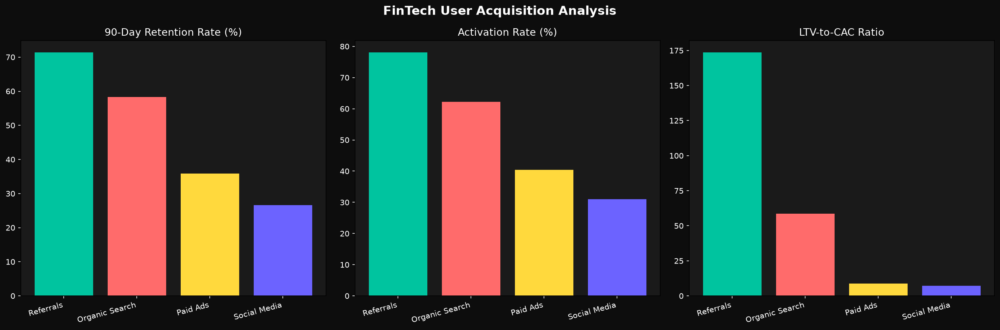

# User Acuisition Analysis(Fintech)

A user acquisition analysis for a Sample FinTech company with 10,000 app/software signups in terms of life time value(LTV) and customer acquisition cost(CAC) over a period of 90 days.

## Overview

10000 user acquisition data generated

The four user acquisition channels- Paid Ads, Refferals, Organic Search, Social Media.

Acquisition channel metrics Founder should look out for.

## Analysis Questions

1. What is the user retention rate over 90 days per acquisition channels?

2. What is the activation rate of each channel over 90 days?

3. what is the LTV-to-CAC ratio for each channel over 90 days?

## Data Used

The [data](fintech_users.csv).

## Project Structure

    FinTech Acquisition Analysis/
    │
    ├── fintech_env/
    │ ├── include
    │ ├── Lib\site-packages
    │ ├── Scripts
    │ ├── share\man\man1
    │ ├── .gitignore
    │ └── pyvenv.cfg
    │
    ├── analysis.py
    ├── fintech_acquisition
    ├── fintech_users.csv
    ├── generate_data.py
    └── README.md

## Installation

    ```bash
    git clone https://github.com/Cid-Kageno-303/repo.git
    cd repo
    pip install -r requirements.txt 
    ```

## Tools Used

→ Pandas

→ Numpy

→ Matplotlib

## Analysis

The [analysis](generate_data.py) depicts clearly how  each question was solved, tackling each major metric founders are to monitor to know which acquisition channel brings in more signups to their app/software so as to effectively manage their user acquisition budget.

## Answers to Questions

**User Retention rate over 90 days per acquisition channels:**

🟢 Refferals 71.36%

🟡 Organic Search 58.31%

🔴Paid Ads 35.91%

🔴 Social Media 26.60%

**Activation Rate (Users who actually convert):**

🟢 Refferals 78.05%

🟡 Organic Search 62.19%

🔴Paid Ads 40.42%

🔴 social Media 30.99%

**LTV-to-CAC Ratio (Value per dollar spent):**

🟢 Refferals 178x

🟡Organic Search 58x

🔴Paid Ads 8x

🔴 Social Media— 7x

### Charts of the findings

**Charts:**



## Recommedations

**1. Brand presence on social media needs to be made evident.**

• Post content around the pain that the app/software solves and show it solves it.

• content should be created more around the experience the app/software gives when it solves the problem it was built to solve.

• Always include a strong CTA(Call To Action) at the end of any post made on social media whether video or text to moer traffic to the app/software.

**2. Stronger brand SEO keywords need to be used.**

• Keywords surroundimg the pain/problem the app/software solves needs to be highly specific, easy to remeber and relevant.

**3. Creating packages/incentives.**

Incentives/packages would be put in place so as to strengthen, maintain and improve refferal rate by existing users/signups once the user base reaches a certain level such as discount on services, holiday offers.

Creation of ambassador programes to spread brand reach and awareness creating a sense of community belonging between the brand and its user.
